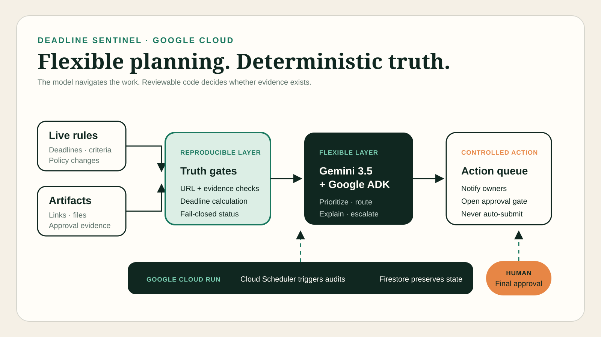
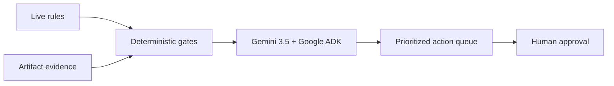

# Deadline Sentinel

An autonomous submission-operations agent that turns deadlines, requirements, and artifact evidence into a verified action queue. Built from scratch during the **All Things Agentic Hackathon 2026**.

## Why it exists

Important submissions fail for mundane reasons: a demo is private, an approval is missing, a rule changed, or the final package was never checked against the current criteria. Deadline Sentinel combines flexible agent planning with deterministic truth gates. The model prioritizes work; code decides whether evidence exists.

## What it does

- Audits required artifacts using reproducible gates.
- Calculates verified readiness and time-to-deadline.
- Uses Gemini through the Google GenAI SDK and a Google ADK agent to turn audit facts into a short action brief.
- Accepts autonomous audit ticks from Cloud Scheduler and records results in Firestore.
- Fails closed when evidence is absent or the AI service is unavailable.
- Reserves final submission for explicit human approval.
- Runs as a responsive web app on Google Cloud Run.

## Architecture





The deterministic validator runs before Gemini. Gemini receives the resulting facts and may prioritize actions, but it cannot upgrade a missing artifact to ready.

## Run locally

```bash
python -m venv .venv
. .venv/bin/activate
pip install -e '.[dev]'
uvicorn sentinel.app:app --reload
```

Open <http://127.0.0.1:8000>. The included scenario uses synthetic data and works without credentials. To use Gemini, set:

```bash
export GEMINI_API_KEY="your-key"
export GEMINI_MODEL="gemini-3.5-flash"
```

## Test

```bash
pytest
```

## Deploy to Google Cloud Run

```bash
gcloud services enable run.googleapis.com cloudbuild.googleapis.com artifactregistry.googleapis.com
gcloud services enable firestore.googleapis.com cloudscheduler.googleapis.com
gcloud artifacts repositories create deadline-sentinel --repository-format=docker --location=us-central1
gcloud builds submit --config cloudbuild.yaml
```

Set `GEMINI_API_KEY` as a Cloud Run secret or environment variable for the live AI brief. The application never requires Gemini to determine readiness; if the model call fails, it returns a deterministic fail-closed summary.

After deployment, schedule the autonomous audit endpoint with an authenticated Cloud Scheduler HTTP job. The endpoint is `POST /api/tick`; every run re-evaluates the active submission and persists a compact record in the `deadline_sentinel_audits` Firestore collection.

## Responsible AI boundary

Deadline Sentinel does not submit applications, certify eligibility, or fabricate supporting material. Uploaded or retrieved text is treated as data, not as instructions. A human remains responsible for final approval.

## Contest disclosure

OpenAI Codex was used as an AI coding assistant during the contest submission period. No pre-existing application code was incorporated.

## License

MIT
